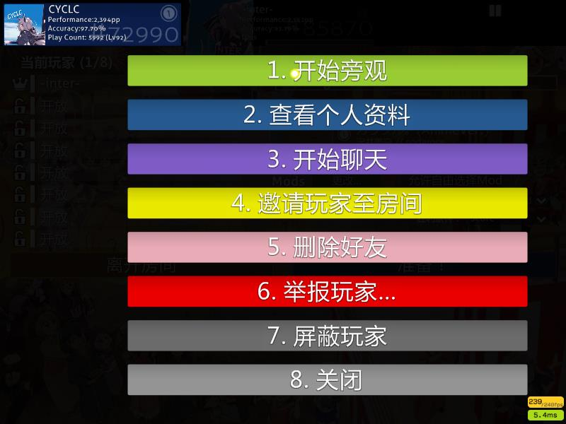

# 聊天控制台

在 *osu!* 的大多数界面上，你可以按下 `F8` 或者点击底部右侧的 ` Show Chat` 按钮在屏幕下方 1/3 的区域显示聊天控制台。

-   选项卡列出当前可用的频道。 只需点击一个标签即可切换到那个频道。 点击 `New` 按钮来显示列表加入新频道。
-   用户名显示的颜色表示不同的意思。

| 颜色 | 用户                                                                                                                                                                                                     |
|--------|----------------------------------------------------------------------------------------------------------------------------------------------------------------------------------------------------------|
| **白色**  | 你                                                                                                                                                                                                      |
| **浅色**   | 非Supporter                                                                                                                                                                                         |
| **黄色** | [osu!supporter](/wiki/osu!supporter/ "osu!supporter")                                                                                                                                           |
| **红色**    | [Global Moderation Team](/wiki/People/Global_Moderation_Team/ "Global Moderation Team") (管理团队) 或 [Quality Assurance Team](/wiki/People/Quality_Assurance_Team/ "Quality Assurance Team")  (图谱质量审核团队) 成员      |
| **绿色**  | 文本中包含你的名字或你添加的某些关键字来触发一个“高亮”。该消息的副本将出现在专用通道 `#highlight` 中，其中包含所有文本。 |
| **蓝色**   | 私聊消息                                                                                                                                                                                         |
| **青色**   | [peppy](https://osu.ppy.sh/u/2 "peppy"), *osu!* 创造者                                                                                                                                            |
| **粉色**   | [BanchoBot](/wiki/BanchoBot/ "BanchoBot")                                                                                                                                                           |

-   当聊天控制台不可见时，单击 `Show Ticker` 框可在屏幕底部显示最新的聊天消息。
-   点击 `Auto-Hide` 框，在游戏过程中可自动隐藏聊天内容(不包括beatmap的开头、结尾和休息时间)。
-   点击 `Hide Chat` 框或再次按下 `F8` 可隐藏聊天控制台。

## 扩展聊天控制台

*[osu!academy](/wiki/Announcements/osu!academy/ "osu!academy") 在 [EP6 (6:52)](https://www.youtube.com/watch?v=cyYRl-a5xII) 和 [多人游戏](/wiki/Multi/ "多人游戏")* 中介绍了这一页。

在 *osu!* 的大多数界面上，你可以按下 `F9` 或单击屏幕右下角的 ` Online Users`按钮来切换至扩展的聊天控制台。 除了聊天控制台之外，扩展聊天还覆盖了屏幕其余 2/3 的屏幕，显示当前用户在 *osu!* 上的信息。

在 osu 中登录的每个用户都有一个在扩展聊天中显示的用户面板。默认情况下，它会显示大致的信息 (名称、总排名、排名、acc、pc数和用户的头像)。当鼠标光标放在它上面时，它会显示一组不同的信息(名称、排名、头像、本地时间、时区、国家位置。如果用户允许，则城市和他们正在做的事情)。

-   过滤器 `好友` 只会过滤并显示出你的好友。
-   `锁定面板` 阻止了面板的刷新，这也包括新用户登录。
-   单击一个选项卡根据该属性对用户面板进行排序。
-   点击显示世界地图，显示每个人的位置。
-   你可以点击拖动右侧白色方块滚动，你也可以使用鼠标滚轮。
-   在面板中没有数据的用户正在使用IRC客户端进行聊天。

| 面板颜色                                                                                        | 描述                                                                                                    |
|-------------------------------------------------------------------------------------------------------|----------------------------------------------------------------------------------------------------------------|
|                                              | 深蓝色 - 玩家现在没事干，或者什么都不做，或者只是在聊天。                                  |
|                                     | 灰色 - 玩家正在单人模式中打图。                                                                              |
|                                  | 浅蓝色 - 玩家正在看回放或观战某人。                                                          |
|                 | 红色 - 玩家正在编辑他们的铺面。                                                                           |
|                 | 紫色 - 玩家正在测试一张图谱。可能是他们的图，可能不是。                                              |
|        | 青绿色 - 玩家正在提交/上传/更新他们制作的铺面。                       |
|                 | 绿色 - 玩家正在编辑或编辑别人的图谱。                                                          |
|                         | 棕色 - 玩家正在多人游戏中，但未开始游戏。                                                            |
|  | 黄色 - 玩家正在多人游戏中愉快的玩耍。                                                                     |
|                                                 | 黑色 - 玩家长时间未活动(Afk)                                                                  |
|                     | 深蓝色，无信息 - 玩家未在游戏中，但从IRC客户端中登录或数据是不可用的。 |

点击任何一个用户面板就会弹出一个选项栏。

按下数字键或点击某栏进行操作：

1.  `开始围观`: 如果用户正在打图，而你有那张图，你就可以在他们打的时候围观。你的昵称将会出现在他们的围观者名单中。
2.  `查看个人资料`: 在浏览器中打开该用户的主页。
3.  `开始聊天`: 与该用户进行私聊.
4.  `邀请玩家至房间`: (如果你在多人游戏中) 邀请用户进入多人游戏房间。
5.  `加为（删除）好友`: 在你的好友列表中添加（删除）该用户。
6.  `举报玩家...`: 举报该用户违反规则。 除非另有说明，否则永远不要使用。 你可以在游戏中以很多理由举报一个用户，也可以在网络上，比如论坛。
7.  `屏蔽玩家`: 该用户的任何信息都不会出现在你的聊天控制台中。
8.  `关闭`: 关闭这个页面。

## 指令列表

### /help

| 指令        | 效果                                                                                         | 例子           | BanchoBot返回信息                                                               | 
|------------------|------------------------------------------------------------------------------------------------|--------------------|----------------------------------------------------------------------------------|
| `/addfriend [user]`   | 在好友列表中添加 `[user]`       | `/addfriend Amigo` | You are now friends with Amigo. |
| `/delfriend [user]`   | 在好友列表中删除 `[user]` | `/delfriend Amigo` | You are no longer friends with Amigo. |
| `/away [message]` | 设置一个当Afk时的消息(发送给用户)。将消息留空以取消。 | `/away I am John Smith.` | You have been marked as being away: I am John Smith. When Amigo /msg John Where are you~?  BanchoBot: I am John Smith.|
| `/bb` | 向bancho发送一条消息，如 rank `[number]` | `/bb rank 1` | [15/11/12] Stats for Uan: Score: 47,323,299,680 (#1) Plays: 176293 (lv102) Accuracy: 98.95% |
| `/chat [user]` | 打开一个新的与指定用户的聊天栏。 | `/chat Amigo` | (Amigo tab is opened) | 
| `/clear` | 清除当前聊天栏中的聊天记录。 | `/clear` | (Clears basically everything on the current tab) | 
| `/ignore [user][@chp]` | 忽略此会话中指定用户的所有消息。通过添加@后面的字母、c、h或p，你可以分别在聊天、`#highlight`或PM中忽略它们。 | `/ignore Amigo@chp` | BanchoBot: You will no longer hear Amigo {chat} {highlights} {PM} (Your chat console is set to: ignore any text written by Amigo [c], any possible text highlighting you by Amigo [h] any Private Message sent to you by Amigo [p]) | 
| `/j [channel]` or `/join [channel]` | 加入指定的频道。 | `/join #lobby` | (#lobby tab is opened) | 
| `/p` or `/part` | 离开当前频道。| `/part` | n/a | 
| `/unignore [user]` | 在这个会话中停止忽略该用户。 | `/unignore Amigo` | You may now hear Amigo. (Your chat console will allow any comment made by Amigo available to your chat console) | 
| `/me [action]` | 执行一个第三人称动作。 | `/me is at home` | * John is at home | 
| `/msg [user] [msg]` | 给 `[user]` 发送私聊消息。 | `/msg Amigo I am sick at home.` | (At Amigo tab) John: I am sick at home. | 
|`/np`| 输出你正在听的或正在玩的歌曲。| `/np`| (If playing) * John is playing [Peter Lambert - osu! tutorial\[Gameplay Basics\]](https://osu.ppy.sh/b/22538) [Game Modes](/wiki/FAQ#alternative-game-modes) \~[Relax/Autopilot](/wiki/Game_Modifiers#special-mods)\~ +[Difficulty increasing mod](/wiki/Game_Modifiers#difficulty-increasing-mods) -[Difficulty decreasing mod](/wiki/Game_Modifiers#difficulty-reduction-mods)/[SpunOut](/wiki/Game_Modifiers#spun-out) [xK](Game_Modifiers#xk) (If doing nothing, based on jukebox) * John is listening to [Peter Lambert - osu! tutorial](https://osu.ppy.sh/b/22538) (If spectating or Autoplay) * John is watching [Peter Lambert - osu! tutorial\[Gameplay basics\]](https://osu.ppy.sh/b/22538) [Game Modes](/wiki/FAQ#alternative-game-modes) \~[Relax/Autopilot](/wiki/Game_Modifiers#special-mods)\~ +[Difficulty increasing mod](/wiki/Game_Modifiers#difficulty-increasing-mods) -[Difficulty decreasing mod](/wiki/Game_Modifiers#difficulty-reduction-mods)/[SpunOut](/wiki/Game_Modifiers#spun-out) [xK](Game_Modifiers#xk) [Autoplay](/wiki/Game_Modifiers#auto)|
| `/reply` or `/r` | 回复最后收到的私人信息。 | `/r Do you know any good doctor?` | (At Amigo tab) [Previous comments] John: I am sick at home. Amigo: Really? John: Do you know any good doctor? | 
| `/savelog` | 将当前对话的聊天信息保存到一个文本文件中。 | `/savelog` | (A folder called "Chat" will be created at the osu! directory which will contain all the future chat tab saves) | 
| `/watch [user]` | 开始围观 `[user]`. | `/watch Amigo` | * Started spectating Amigo. (When Amigo plays a beatmap that you have, you will spectate his play [after some buffering] with your name on the left of Amigo screen) | 
| `/nopm` | 切换到只允许来自所有人的信息或朋友的私信 | `/nopm` | (A pop-up banner will appear at the center detailing you are allowing everyone/friends only for private messages) | 
| `/invite [user]` | 用连接邀请 `[user]` 到多人游戏。 | `/invite Nathanael` | * Nathanael has been invited to the game | 

### /keys

| 键     | 效果                                                   |
|-------------------|----------------------------------------------------------|
| `Page Up` / `Page Down` | 聊天窗口滚动。你也可以使用鼠标滚轮。|
| `Tab`               | 自动输入当前需输入的昵称。                 |
| `F8`                | 切换至聊天控制台。                                     |
| `F9`                | 切换至扩展聊天控制台。                            |
| `Ctrl` + `C` / `V`        | 复制/粘贴                                              |
| `Alt` + `0` - `9`         | 切换到相应的选项卡。                               |
