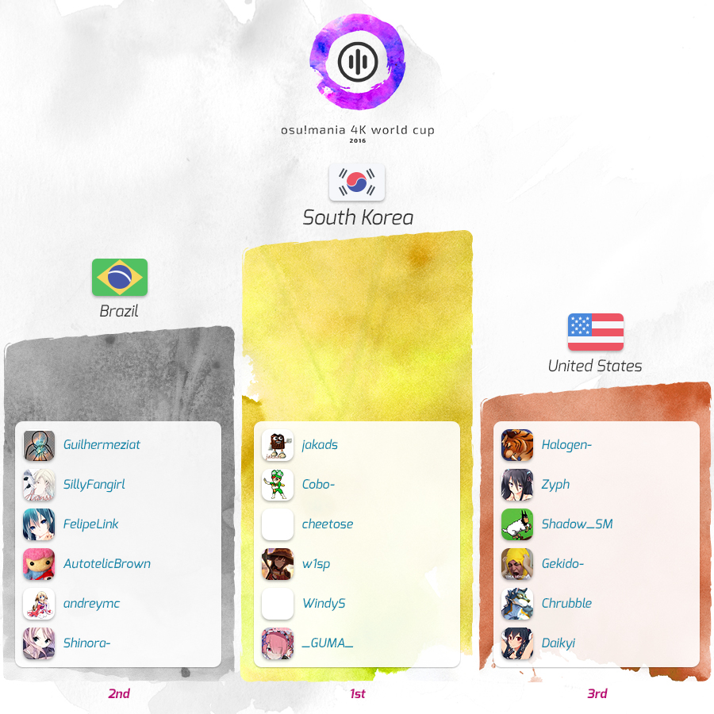
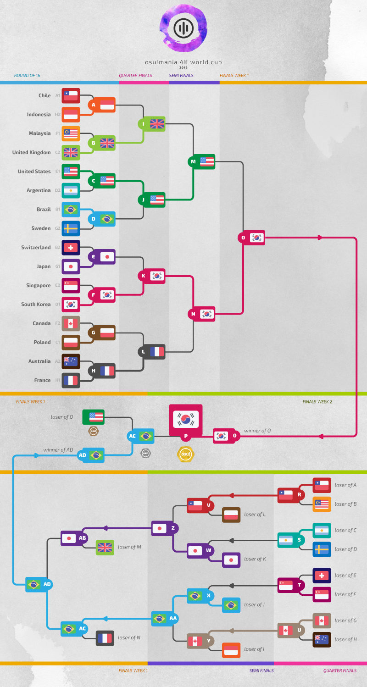

---
tags:
  - MWC 2016
  - MWC 4K 2016
  - MWC2016
  - MWC4K 2016
---
# osu!mania 4K World Cup 2016

The **osu!mania 4K World Cup 2016** (***MWC4K 2016***) is a country-based 4-key osu!mania tournament hosted by the [osu! staff](/wiki/People/The_Team). It is part of the 3rd installment of the osu!mania World Cup.

## Tournament Schedule

|              Event | Timestamp               |
| ------------------:| ----------------------- |
| Registration Phase | 2016-06-28/2016-07-17   |
|           Drawings | 2016-07-31 14:00:00 UTC |
|        Group Stage | 2016-08-06/2016-08-07   |
|        Round of 16 | 2016-08-13/2016-08-14   |
|      Quarterfinals | 2016-08-20/2016-08-21   |
|         Semifinals | 2016-08-27/2016-08-28   |
|             Finals | 2016-09-03/2016-09-04   |
|       Grand Finals | 2016-09-10/2016-09-11   |

## Prizes

We are aiming to have a minimum $1,900 cash prize pool for this world cup. You can support raising this amount of money by **[purchasing a profile banner for your team here!](https://store.ppy.sh/store/product/150)**

|                       Placing                        | Prize(s)                                                                     |
|:----------------------------------------------------:|:---------------------------------------------------------------------------- |
|    | 50% of the raised prize pool, profile badge, "osu!mania Champion" user title |
|  | 38% of the raised prize pool, profile badge                                  |
|  | 12% of the raised prize pool, profile badge                                  |

## Organization

The osu!mania 4K World Cup 2016 is run by various community members by distributing the multitude of tasks into various fields of responsibility.

<table>
  <tr>
    <th>
      Position
    </th>
    
    <th>
      Member(s)
    </th>
  </tr>
  
  <tr>
    <td>
      Tournament Management
    </td>
    
    <td>
       <a href="https://osu.ppy.sh/users/71366">Loctav</a>,  <a href="https://osu.ppy.sh/users/123703">p3n</a>,  <a href="https://osu.ppy.sh/users/318565">Deif</a>,  <a href="https://osu.ppy.sh/users/776257">shARPII</a>
    </td>
  </tr>
  
  <tr>
    <td>
      Map Selectors
    </td>
    
    <td>
       <a href="https://osu.ppy.sh/users/2124783">-Kamikaze-</a>,  <a href="https://osu.ppy.sh/users/2520707">Shoegazer</a>
    </td>
  </tr>
  
  <tr>
    <td>
      Commentators
    </td>
    
    <td>
       <a href="https://osu.ppy.sh/users/811832">Daikyi</a>,  <a href="https://osu.ppy.sh/users/128370">deadbeat</a>,  <a href="https://osu.ppy.sh/users/169992">Halogen-</a>,  <a href="https://osu.ppy.sh/users/443656">juankristal</a>,  <a href="https://osu.ppy.sh/users/6108644">-Konner-</a>,  <a href="https://osu.ppy.sh/users/4823843">Slainv</a>,  <a href="https://osu.ppy.sh/users/2520707">Shoegazer</a>,  <a href="https://osu.ppy.sh/users/1031958">Tasha</a>,  <a href="https://osu.ppy.sh/users/6347">ztrot</a>
    </td>
  </tr>
  
  <tr>
    <td>
      Statistician
    </td>
    
    <td>
       <a href="https://osu.ppy.sh/users/128370">deadbeat</a>,  <a href="https://osu.ppy.sh/users/1910766">Nwolf</a>
    </td>
  </tr>
</table>

* * *

* * *

* * *

## Participants

| Top Seed                                     | High Seed                                 | Low Seed                                  | Unseeded                                         |
| -------------------------------------------- | ----------------------------------------- | ----------------------------------------- | ------------------------------------------------ |
|  Brazil         |  Argentina   |  Australia   |  Belgium            |
|  Canada         |  Germany     |  Denmark     |  Hong Kong          |
|  Chile          |  Indonesia   |  Finland     |  Lithuania          |
|  France         |  Malaysia    |  Italy       |  Macau              |
|  Japan          |  Philippines |  New Zealand |  Mexico             |
|  South Korea    |  Poland      |  Norway      |  Netherlands        |
|  United Kingdom |  Spain       |  Singapore   |  Russian Federation |
|  United States  |  Thailand    |  Switzerland |  Sweden             |

|                               |    Country    | Group A Members                                                                                                                                                                                                                                                                                   |
|:-----------------------------:|:-------------:| ------------------------------------------------------------------------------------------------------------------------------------------------------------------------------------------------------------------------------------------------------------------------------------------------- |
|  |   **Chile**   | **[Arkener](https://osu.ppy.sh/users/4116072)**, [Urusai](https://osu.ppy.sh/users/469808), [Demitoo](https://osu.ppy.sh/users/1206206), [sebaex](https://osu.ppy.sh/users/4686036), [WalterToro](https://osu.ppy.sh/users/5281416), [bastianaraya](https://osu.ppy.sh/users/3181733)             |
|  | **Thailand**  | **[*S h i r o*](https://osu.ppy.sh/users/766374)**, [nowsmart](https://osu.ppy.sh/users/1935034), [- N A K O -](https://osu.ppy.sh/users/2526720), [Zenonia](https://osu.ppy.sh/users/437945), [\[13\] BECK](https://osu.ppy.sh/users/2656374), [bhonris](https://osu.ppy.sh/users/2838908) |
|  | **Australia** | **[Shirinisu](https://osu.ppy.sh/users/4922584)**, [NotDeadYet](https://osu.ppy.sh/users/4081831), [PotassiumF](https://osu.ppy.sh/users/4247722), [Alchalyne](https://osu.ppy.sh/users/3999031), [Parachor](https://osu.ppy.sh/users/5241655), [Evios](https://osu.ppy.sh/users/2058022)         |
|  |   **Macau**   | **[idqoos123](https://osu.ppy.sh/users/3946113)**, [LuciDestiny](https://osu.ppy.sh/users/8041703), [1063520328](https://osu.ppy.sh/users/4939686)                                                                                                                                                |

|                               |     Country     | Group B Members                                                                                                                                                                                                                                                                                           |
|:-----------------------------:|:---------------:| --------------------------------------------------------------------------------------------------------------------------------------------------------------------------------------------------------------------------------------------------------------------------------------------------------- |
|  |   **Brazil**    | **[Guilhermeziat](https://osu.ppy.sh/users/3661387)**, [HanssFangirl](https://osu.ppy.sh/users/2288363), [FelipeLink](https://osu.ppy.sh/users/4917435), [AutotelicBrown](https://osu.ppy.sh/users/4238941), [andreymc](https://osu.ppy.sh/users/5691061), [Konoe-chan](https://osu.ppy.sh/users/5828575) |
|  |    **Spain**    | **[aitor98](https://osu.ppy.sh/users/3154852)**, [Userbacker](https://osu.ppy.sh/users/1872307), [AlvaRo5498](https://osu.ppy.sh/users/4490967), [Asesingta](https://osu.ppy.sh/users/5037769), [R3k3T3](https://osu.ppy.sh/users/4520329), [BadAccPlayer](https://osu.ppy.sh/users/4541413)              |
|  | **Switzerland** | **[Akayro](https://osu.ppy.sh/users/2573716)**, [Haprapra](https://osu.ppy.sh/users/3974114), [basti78](https://osu.ppy.sh/users/28222), [Gamer97](https://osu.ppy.sh/users/4952941)                                                                                                                      |
|  |  **Lithuania**  | **[simasx1111](https://osu.ppy.sh/users/5176599)**, [PenguinEatsFish](https://osu.ppy.sh/users/6588446), [Metallica](https://osu.ppy.sh/users/6560198)                                                                                                                                                    |

|                               |      Country       | Group C Members                                                                                                                                                                                                                                                                         |
|:-----------------------------:|:------------------:| --------------------------------------------------------------------------------------------------------------------------------------------------------------------------------------------------------------------------------------------------------------------------------------- |
|  | **United Kingdom** | **[-Konner-](https://osu.ppy.sh/users/6108644)**, [yipyapyop](https://osu.ppy.sh/users/5156656), [Pope Gadget](https://osu.ppy.sh/users/2288341), [Pipper](https://osu.ppy.sh/users/4168230), [Xonica](https://osu.ppy.sh/users/3586776), [Hayabusa](https://osu.ppy.sh/users/3104108)  |
|  |     **Poland**     | **[Tidek](https://osu.ppy.sh/users/743282)**, [Hudonom](https://osu.ppy.sh/users/1654221), [SitekX](https://osu.ppy.sh/users/3840946), [\_underjoy](https://osu.ppy.sh/users/2235750), [Grubonom](https://osu.ppy.sh/users/5757447), [Transformau5](https://osu.ppy.sh/users/3109917) |
|  |     **Norway**     | **[Staiain](https://osu.ppy.sh/users/86188)**, [Duyang](https://osu.ppy.sh/users/5021522), [HennyCovers](https://osu.ppy.sh/users/4266693), [Priest](https://osu.ppy.sh/users/3037964), [KarlF](https://osu.ppy.sh/users/3494742), [Hjeg](https://osu.ppy.sh/users/2764122)             |
|  |   **Hong Kong**    | **[Opean](https://osu.ppy.sh/users/4544555)**, [Mooncha](https://osu.ppy.sh/users/5417362), [xYakumo\_Yukarix](https://osu.ppy.sh/users/3801443)                                                                                                                                      |

|                               |     Country     | Group D Members                                                                                                                                                                                                                                                                   |
|:-----------------------------:|:---------------:| --------------------------------------------------------------------------------------------------------------------------------------------------------------------------------------------------------------------------------------------------------------------------------- |
|  | **South Korea** | **[jakads](https://osu.ppy.sh/users/259972)**, [Cobo-](https://osu.ppy.sh/users/1482965), [cheetose](https://osu.ppy.sh/users/3817144), [w1sp](https://osu.ppy.sh/users/2770796), [WindyS](https://osu.ppy.sh/users/1190879), [*GUMA*](https://osu.ppy.sh/users/2306590)      |
|  |  **Argentina**  | **[juankristal](https://osu.ppy.sh/users/443656)**, [lxLucasxl](https://osu.ppy.sh/users/3632846), [Genwin](https://osu.ppy.sh/users/5748843), [aluuu](https://osu.ppy.sh/users/4585260), [Grindei](https://osu.ppy.sh/users/4228356), [Icaruz](https://osu.ppy.sh/users/2605137) |
|  |   **Finland**   | **[Jepetski](https://osu.ppy.sh/users/3794665)**, [LoliScarlet](https://osu.ppy.sh/users/5014674), [Herkkupala](https://osu.ppy.sh/users/3602620), [matti644](https://osu.ppy.sh/users/1982941)                                                                                   |
|  | **Netherlands** | **[mijkolsmith](https://osu.ppy.sh/users/4307765)**, [Chronocide](https://osu.ppy.sh/users/5425324), [CreationEU](https://osu.ppy.sh/users/4004441)                                                                                                                               |

|                               |      Country      | Group E Members                                                                                                                                                                                                                                                                                 |
|:-----------------------------:|:-----------------:| ----------------------------------------------------------------------------------------------------------------------------------------------------------------------------------------------------------------------------------------------------------------------------------------------- |
|  | **United States** | **[Halogen-](https://osu.ppy.sh/users/169992)**, [Zyph](https://osu.ppy.sh/users/1600432), [Shadow_SM](https://osu.ppy.sh/users/4552987), [Gekido-](https://osu.ppy.sh/users/4693052), [Chrubble](https://osu.ppy.sh/users/2594280), [Daikyi](https://osu.ppy.sh/users/811832)                  |
|  |  **Philippines**  | **[arcwinolivirus](https://osu.ppy.sh/users/2039089)**, [KatayokuNoTori](https://osu.ppy.sh/users/5968733), [scissorsf](https://osu.ppy.sh/users/6378800), [Ainyan](https://osu.ppy.sh/users/3770641), [Frizu](https://osu.ppy.sh/users/4067614), [SurfChu85](https://osu.ppy.sh/users/4469895) |
|  |   **Singapore**   | **[danielrox](https://osu.ppy.sh/users/4893212)**, [Paralit](https://osu.ppy.sh/users/876528), [OrienST8](https://osu.ppy.sh/users/4574597), [wafuu](https://osu.ppy.sh/users/2095061), [Raveille](https://osu.ppy.sh/users/1388767), [Level 51](https://osu.ppy.sh/users/3617847)              |
|  |    **Belgium**    | **[Akeyro](https://osu.ppy.sh/users/1933624)**, [Joeycheng02](https://osu.ppy.sh/users/4381142), [Yetified](https://osu.ppy.sh/users/6914714), [kyle5342](https://osu.ppy.sh/users/4951361)                                                                                                     |

|                               |        Country         | Group F Members                                                                                                                                                                                                                                                                                  |
|:-----------------------------:|:----------------------:| ------------------------------------------------------------------------------------------------------------------------------------------------------------------------------------------------------------------------------------------------------------------------------------------------ |
|  |       **Canada**       | **[Ashix-](https://osu.ppy.sh/users/981144)**, [beary605](https://osu.ppy.sh/users/2198070), [Hinpoppo](https://osu.ppy.sh/users/6032845), [CommandoBlack](https://osu.ppy.sh/users/7025841), [GameControl](https://osu.ppy.sh/users/5185455), [Piggy](https://osu.ppy.sh/users/5390121)         |
|  |      **Malaysia**      | **[Cryolien](https://osu.ppy.sh/users/1626983)**, [Explosive-XII](https://osu.ppy.sh/users/7735071), [LawXIII](https://osu.ppy.sh/users/3703360), [UchihaxHoNG](https://osu.ppy.sh/users/4836079), [seyren95](https://osu.ppy.sh/users/1761259), [kaname-san92](https://osu.ppy.sh/users/764535) |
|  |    **New Zealand**     | **[Worms](https://osu.ppy.sh/users/1963937)**, [FantumEX](https://osu.ppy.sh/users/3394802), [Frampleton](https://osu.ppy.sh/users/3580643), [Nyao](https://osu.ppy.sh/users/2068663), [Alamanar](https://osu.ppy.sh/users/7621152), [Spicy Meme](https://osu.ppy.sh/users/6571078)              |
|  | **Russian Federation** | **[PhobosX](https://osu.ppy.sh/users/2570019)**, [EYA-](https://osu.ppy.sh/users/6375083), [SpinForWin](https://osu.ppy.sh/users/5527957), [AJIekceu](https://osu.ppy.sh/users/940656), [Rygamine](https://osu.ppy.sh/users/5145890), [Dereku](https://osu.ppy.sh/users/2607745)                 |

|                               |   Country   | Group G Members                                                                                                                                                                                                                                                                               |
|:-----------------------------:|:-----------:| --------------------------------------------------------------------------------------------------------------------------------------------------------------------------------------------------------------------------------------------------------------------------------------------- |
|  |  **Japan**  | **[inteliser](https://osu.ppy.sh/users/1824775)**, [PiraTom](https://osu.ppy.sh/users/1847698), [Sharped Tiala](https://osu.ppy.sh/users/6879936), [Snow Wind](https://osu.ppy.sh/users/2163585), [DenkyuSM](https://osu.ppy.sh/users/7194397)                                                |
|  | **Germany** | **[Phil](https://osu.ppy.sh/users/3191489)**, [Xay](https://osu.ppy.sh/users/961417), [stankill](https://osu.ppy.sh/users/2583455), [lEdelWeiss](https://osu.ppy.sh/users/6017975), [Sakura Kyoko](https://osu.ppy.sh/users/4282445), [Dreamgate](https://osu.ppy.sh/users/3921273)           |
|  |  **Italy**  | **[Virtox](https://osu.ppy.sh/users/6631567)**, [\[Kaikyu\]](https://osu.ppy.sh/users/7231991), [GianluTroll](https://osu.ppy.sh/users/5757189), [\[ Akise \]](https://osu.ppy.sh/users/5124074), [magnans](https://osu.ppy.sh/users/1363449)                                             |
|  | **Sweden**  | **[Couil](https://osu.ppy.sh/users/6872025)**, [\[ Vento \]](https://osu.ppy.sh/users/1612580), [-Saoeri-](https://osu.ppy.sh/users/6702799), [Craty](https://osu.ppy.sh/users/3918056), [RilipGirlfriend](https://osu.ppy.sh/users/4999669), [Lamaredia](https://osu.ppy.sh/users/3362365) |

|                               |    Country    | Group H Members                                                                                                                                                                                                                                                                                   |
|:-----------------------------:|:-------------:| ------------------------------------------------------------------------------------------------------------------------------------------------------------------------------------------------------------------------------------------------------------------------------------------------- |
|  |  **France**   | **[bumpinho](https://osu.ppy.sh/users/1594604)**, [lim38](https://osu.ppy.sh/users/2741170), [\[ AlexHgC \]](https://osu.ppy.sh/users/4304933), [adrien062](https://osu.ppy.sh/users/2131990), [Elementaires](https://osu.ppy.sh/users/2284328), [Todestrieb](https://osu.ppy.sh/users/4056690) |
|  | **Indonesia** | **[Fiea](https://osu.ppy.sh/users/3183277)**, [Kephin](https://osu.ppy.sh/users/5033561), [ExKagii-](https://osu.ppy.sh/users/4591324), [DoNotMess](https://osu.ppy.sh/users/1596318), [lpddemon](https://osu.ppy.sh/users/5101276), [reyss](https://osu.ppy.sh/users/4557440)                    |
|  |  **Denmark**  | **[Jole](https://osu.ppy.sh/users/2883132)**, [Ramena](https://osu.ppy.sh/users/1245964), [Crowii](https://osu.ppy.sh/users/3795152), [mart732c](https://osu.ppy.sh/users/4402263), [Oriba Hoi](https://osu.ppy.sh/users/7129731)                                                                 |
|  |  **Mexico**   | **[*Mytros*](https://osu.ppy.sh/users/6507028)**, [Pollo184](https://osu.ppy.sh/users/3350481), [Chizuru-](https://osu.ppy.sh/users/4301301), [ShaddBladex](https://osu.ppy.sh/users/2530995)                                                                                                 |

* * *

## Mappools

### Finals

**This mappool will be used in Finals and Grand Finals**

[Download the mappack here!](https://www.mediafire.com/download/k67i387mj5kdmec/MWC_4K_2016_Finals.rar)

- NoMod 
  - [Tatsh - IMAGE -MATERIAL- \<version 0\> (Fullerene-) \[Refraction\]](https://osu.ppy.sh/b/1048210)
  - [ZUN - Voyage 1970 (Halogen-) \[Hourai Elixir\]](https://osu.ppy.sh/b/961223)
  - [Hommarju - Hellfire (snoverpk) \[GRAVITY\]](https://osu.ppy.sh/b/1003669)
  - [Fleshgod Apocalypse - The Violation (Shoegazer) \[Desecration\]](https://osu.ppy.sh/b/1056624)
  - [sun3 - Morgenglut 2012 (\_underjoy) \[4K Lv. XXX\]](https://osu.ppy.sh/b/993347)
  - [Suguro - Sun Valley (K2 Remix) (Guilhermeziat) \[le 8-bit\]](https://osu.ppy.sh/b/950875)
  - [t+pazolite vs RoughSketch - Readymade Luv (Ciel) \[Homemade Chocolate\]](https://osu.ppy.sh/b/1045122)
  - [Camellia - Fastest Crash (Shoegazer) \[Paroxysm\]](https://osu.ppy.sh/b/924286)
  - [Kommisar - Southern Waters Assault 8bit (Gekido-) \[LN Master\]](https://osu.ppy.sh/b/1022204)
  - [LeaF - I (Tidek) \[Limbo\]](https://osu.ppy.sh/b/921164)
- FreeMod 
  - [t+pazolite with siromaru - Chambarising (Evening) \[Challenge\]](https://osu.ppy.sh/b/923890)
  - [xi - FREEDOM DiVE (razlteh) \[Fullerene's 4K DIMENSIONS\]](https://osu.ppy.sh/b/473228)
  - [ikaruga_nex - Mirage (inteliser) \[UNLIMITED \[LN\]\]](https://osu.ppy.sh/b/1038091)
  - [Camellia - dreamless wanderer (Fullerene-) \[Ethereal Shift\]](https://osu.ppy.sh/b/714878)
- Tiebreaker 
  - [Camellia - I Can Fly In The Universe (Evening) \[Schizophrenia\]](https://osu.ppy.sh/b/1055345)

### Semifinals

**[Download the mappack here!](https://www.mediafire.com/download/wyp4gi7pun5vr0l/MWC4K_2016_Semifinals.rar)**

- NoMod 
  - [\_yosuke & MOKONA - Sumowind (\_underjoy) \[Falling Leaves\]](https://osu.ppy.sh/b/1037449)
  - [Srav3R - Kamuy (dionzz99) \[Classical Core\]](https://osu.ppy.sh/b/970021)
  - [IOSYS - Bow Down, You Ignorant Fools! -The Princess' Insane All Night Hourai Live- (Xay) \[Xay's 4k\]](https://osu.ppy.sh/b/1000026)
  - [Loctek - Kan-Construction (Daikyi) \[LSC\]](https://osu.ppy.sh/b/1039232)
  - [Paitan - LEMON SUMMER (inteliser) \[OVERFLOW \[LN\]](https://osu.ppy.sh/b/1017817)
  - [U1 High-Speed - EGOISM 440 (Chrubble) \[CHALLENGE\]](https://osu.ppy.sh/b/813652)
  - [Rotteen - VEC+LEGGENDARIA (Quick Draw) \[4K SC\]](https://osu.ppy.sh/b/756998)
  - [ALiCE'S EMOTiON - Dark Flight Dreamer (PiraTom) \[LN MASTER SPARK!!\]](https://osu.ppy.sh/b/976201)
  - [Spawn of Possession - Apparition (XeoStyle) \[Duty to God\]](https://osu.ppy.sh/b/797527)
  - [PolyphonicBranch - LOVE x LOVE Whistle (PiraTom) \[LOVE STREAM\]](https://osu.ppy.sh/b/968401)
- FreeMod 
  - [Fallujah - Sapphire (Shoegazer) \[Cerulean\]](https://osu.ppy.sh/b/970464)
  - [t+pazolite - Oshama Scramble! (Shirou) \[Nyan~\]](https://osu.ppy.sh/b/815040)
  - [Rings of Saturn - Eviscerate (Xay) \[Xay's 4k\]](https://osu.ppy.sh/b/1020016)
  - [sHimaU - GOD of MADNESS (Valedict) \[Lovecraftian\]](https://osu.ppy.sh/b/954116)
- Tiebreaker 
  - [D.B.O.Y.D x Kommisar - Interstellar Retribution (MasterSonic10) \[Disbelief\]](https://osu.ppy.sh/b/823799)

### Quarterfinals

**[Download the mappack here!](https://www.mediafire.com/download/x8fv79n1mb1miss/MWC_4K_2016_Quarterfinals.rar)**

- NoMod 
  - [Memme - Chinese Restaurant (ajeemaniz) \[Insanity "Noodles"\]](https://osu.ppy.sh/b/579715)
  - [DEV/NULL - Rave 7 (hi19hi19) \[Hard\]](https://osu.ppy.sh/b/480466)
  - [Camellia - Ultimate Ascension (Fresh Chicken) \[GRAVITY\]](https://osu.ppy.sh/b/1017927)
  - [Neun\_jack - Gypsy gets the Tek (LeiN-) \[wag\]](https://osu.ppy.sh/b/991504)
  - [Morimori Atsushi + Verdammt - Le Fruit Defendu (MasterSonic10) \[INFINITE Lv.15\]](https://osu.ppy.sh/b/782892)
  - [BlackY - Depravity CLiMAXXX (Valedict) \[Desperado\]](https://osu.ppy.sh/b/893354)
  - [Kuroneko Dungeon - Ryoushi no Umi no Lindwurm (-Kamikaze-) \[Calculation\]](https://osu.ppy.sh/b/973263)
  - [lapix - Foolish Hero (dionzz99) \[Fooled\]](https://osu.ppy.sh/b/1040762)
  - [Venetian Snares - She Runs (Shoegazer) \[Breakaway\]](https://osu.ppy.sh/b/961767)
  - [maras k - Play Time!! (MasterSonic10) \[SC\]](https://osu.ppy.sh/b/692198)
- FreeMod 
  - [DesoloZ - Summoned Beast Battle (Halogen-) \[Destruction\]](https://osu.ppy.sh/b/901157)
  - [DJ'TEKINA//SOMETHING - Palette GAMMA (Cadmium-113) \[Affection\]](https://osu.ppy.sh/b/888774)
  - [Terminal 11 - The Bird's Poisoned Bathwater (Xay) \[Xay's 4k\]](https://osu.ppy.sh/b/1000029)
  - [kemu - Ikasama Life game (Thievley) \[Smith's MX\]](https://osu.ppy.sh/b/1005445)
- Tiebreaker 
  - [b4kn - Act V - The Battle At Mammoth Mountain (Halogen-) \[Finale\]](https://osu.ppy.sh/b/1040978)

### Round of 16

**[Download the mappack here!](https://www.mediafire.com/download/8ixrt0vl4si4fko/MWC_4K_2016_Round_of_16.rar)**

- NoMod 
  - [Nobuo Uematsu - Liberi Fatali (Halogen-) \[Insane\]](https://osu.ppy.sh/b/816901)
  - [xxdbxx - Taekwonburi (nowsmart) \[4K MX\]](https://osu.ppy.sh/b/465220)
  - [Yu\_Asahina - Trickstarz (hi19hi19) \[Hard\]](https://osu.ppy.sh/b/770549)
  - [Shawn Wasabi - Marble Soda (Hydria) \[Pope's Insane\]](https://osu.ppy.sh/b/967910)
  - [Omoi - Snow Drive (Weegle) \[The Last Way Home\]](https://osu.ppy.sh/b/797441)
  - [alan - Over the clouds -BURST mix- (LordRaika) \[4K MX\]](https://osu.ppy.sh/b/564610)
  - [LeaF - Calamity Fortune (Shoegazer) \[Euphoria\]](https://osu.ppy.sh/b/938145)
  - [sawawa - Cirno Break (Verniy\_Chan) \[MEGA's EXHAUST\]](https://osu.ppy.sh/b/646643)
  - [Helblinde - Rewrite Nightmare (Jepetski) \[Experiment\]](https://osu.ppy.sh/b/719525)
  - [Feryquitous - Strahv (Tornspirit) \[Regret\]](https://osu.ppy.sh/b/891620)
- FreeMod 
  - [100-200-400 - Fascination MAXX (Ereedon) \[\_UJ's 4K Heavy\]](https://osu.ppy.sh/b/927196)
  - [UNDEAD CORPORATION - karakurenawi (Tidek) \[Insane\]](https://osu.ppy.sh/b/730528)
  - [Hommarju - Sounds of Summer (\[Shana Lesus\]) \[Another\]](https://osu.ppy.sh/b/770372)
  - [ginkiha - nightfall (Abraxos) \[rave's dream\]](https://osu.ppy.sh/b/1010821)
- Tiebreaker 
  - [aaaa - Bokutachi no Tabi to Epilogue.\[Long ver.\] (Daikyi) \[Final Voyage\]](https://osu.ppy.sh/b/834266)

### Group Stage

**[Download the mappack here!](https://www.mediafire.com/download/p39r1ckct4kjg91/MWC_4K_2016_Group_Stage.rar)**

- NoMod 
  - [The Ghost of 3.13 - Last Star In The Universe (Shoegazer) \[Nocturne\]](https://osu.ppy.sh/b/678855)
  - [Yamamoto Momiji - Doutei Korose (short Ver.) (ALEFY) \[EXH\]](https://osu.ppy.sh/b/923934)
  - [Yokomin feat. Yuzuki Yukari - Story In Everlasting Princess (\[ A v a l o n \]) \[4K Hyper\]](https://osu.ppy.sh/b/739982)
  - [Yooh - Electronic Sound Lab (XeoStyle) \[MX\]](https://osu.ppy.sh/b/673946)
  - [Anamanaguchi - Power Supply (Halogen-) \[Charge\]](https://osu.ppy.sh/b/901153)
  - [NAGI - inside (Jinjin) \[Longing\]](https://osu.ppy.sh/b/1016139)
  - [Gavin G - Refresh (game rock) \[Momo's MX\]](https://osu.ppy.sh/b/638907)
  - [Rush - Malignant Narcissism (Pope Gadget) \[R40\]](https://osu.ppy.sh/b/954903)
  - [Lindsey Stirling - Senbonzakura (MrSergio) \[Harby's HD\]](https://osu.ppy.sh/b/671989)
  - [Vospi - roboposition!! (arviejhay) \[4K HD\]](https://osu.ppy.sh/b/400180)
- FreeMod 
  - [NISH - Space Time (\_underjoy) \[4K Another\]](https://osu.ppy.sh/b/888588)
  - [Shiki - Endless Dream (Shoegazer) \[Hyper\]](https://osu.ppy.sh/b/867245)
  - [DJ OKAWARI - Canon (schwarzvgrune) \[Clamorous (Insane)\]](https://osu.ppy.sh/b/661929)
  - [SON OF KICK - Hours ft. Lady Leshurr & Paigey Cakey (Irreversible) \[Feru's HD\]](https://osu.ppy.sh/b/745024)
- Tiebreaker 
  - [KotoriP - Black Out The Alternative (Pope Gadget) \[The Former\]](https://osu.ppy.sh/b/726209)

* * *

## Match Results

**[Detailed match statistics here!](https://docs.google.com/spreadsheets/d/1GSFF2W81heDb8oTdrp_R-w4sTNBvf3tv0Rdmpxsw_U0/pubhtml)**

### Grand Finals

|                                    2016-09-10 |       |  |                                      |                                                     |
| ---------------------------------------------:|:-----:|::|:------------------------------------ |:---------------------------------------------------:|
| **South Korea**  | **7** |  |  Brazil | [#1](https://osu.ppy.sh/community/matches/27652825) |

### Finals

|                                  2016-09-03 |       |       |                                               |                                                     |
| -------------------------------------------:|:-----:|:-----:|:--------------------------------------------- |:---------------------------------------------------:|
| United States  |       | **6** |  **South Korea** | [#1](https://osu.ppy.sh/community/matches/27505279) |
|     **Japan**  | **6** |   3   |  United Kingdom  | [#1](https://osu.ppy.sh/community/matches/27510481) |
|    **Brazil**  | **6** |       |  France          | [#1](https://osu.ppy.sh/community/matches/27512221) |
|         Japan  |       | **6** |  **Brazil**      | [#1](https://osu.ppy.sh/community/matches/27513965) |

|                                  2016-09-04 |   |       |                                          |                                                     |
| -------------------------------------------:|:-:|:-----:|:---------------------------------------- |:---------------------------------------------------:|
| United States  | 2 | **6** |  **Brazil** | [#1](https://osu.ppy.sh/community/matches/27551501) |

### Semifinals

|                                    2016-08-28 |       |       |                                                 |                                                     |
| ---------------------------------------------:|:-----:|:-----:|:----------------------------------------------- |:---------------------------------------------------:|
| **South Korea**  | **6** |       |  France            | [#1](https://osu.ppy.sh/community/matches/27342270) |
|       Argentina  |       | **6** |  **Japan**         |                  -win by default-                   |
|       Singapore  |       | **6** |  **Brazil**        | [#1](https://osu.ppy.sh/community/matches/27346316) |
|      **Canada**  | **6** |   4   |  Indonesia         | [#1](https://osu.ppy.sh/community/matches/27348592) |
|       **Chile**  | **6** |   3   |  Poland            | [#1](https://osu.ppy.sh/community/matches/27350846) |
|  United Kingdom  |   4   | **6** |  **United States** | [#1](https://osu.ppy.sh/community/matches/27353347) |

|                               2016-08-29 |       |       |                                         |                                                     |
| ----------------------------------------:|:-----:|:-----:|:--------------------------------------- |:---------------------------------------------------:|
|      Chile  |       | **6** |  **Japan** | [#1](https://osu.ppy.sh/community/matches/27372674) |
| **Brazil**  | **6** |       |  Canada    | [#1](https://osu.ppy.sh/community/matches/27382022) |

### Quarterfinals

|                                      2016-08-21 |       |       |                                                  |                                                     |
| -----------------------------------------------:|:-----:|:-----:|:------------------------------------------------ |:---------------------------------------------------:|
|        **Canada**  | **5** |   2   |  Australia          | [#1](https://osu.ppy.sh/community/matches/27192490) |
|             Japan  |       | **5** |  **South Korea**    |                  -win by default-                   |
|       Switzerland  |       | **5** |  **Singapore**      |                  -win by default-                   |
|         Indonesia  |   1   | **5** |  **United Kingdom** | [#1](https://osu.ppy.sh/community/matches/27201519) |
|         **Chile**  | **5** |   3   |  Malaysia           | [#1](https://osu.ppy.sh/community/matches/27202248) |
|            Poland  |   1   | **5** |  **France**         | [#1](https://osu.ppy.sh/community/matches/27206508) |
|     **Argentina**  | **5** |       |  Sweden             | [#1](https://osu.ppy.sh/community/matches/27207843) |
| **United States**  | **5** |   2   |  Brazil             | [#1](https://osu.ppy.sh/community/matches/27209327) |

### Round of 16

|                                      2016-08-13 |       |       |                                                  |                                                     |
| -----------------------------------------------:|:-----:|:-----:|:------------------------------------------------ |:---------------------------------------------------:|
|         Singapore  |       | **5** |  **South Korea**    | [#1](https://osu.ppy.sh/community/matches/27007849) |
|         Australia  |   1   | **5** |  **France**         | [#1](https://osu.ppy.sh/community/matches/27008721) |
|       Switzerland  |       | **5** |  **Japan**          | [#1](https://osu.ppy.sh/community/matches/27009804) |
|          Malaysia  |   1   | **5** |  **United Kingdom** | [#1](https://osu.ppy.sh/community/matches/27011029) |
|             Chile  |   2   | **5** |  **Indonesia**      | [#1](https://osu.ppy.sh/community/matches/27012590) |
|        **Brazil**  | **5** |       |  Sweden             | [#1](https://osu.ppy.sh/community/matches/27016306) |
|            Canada  |       | **5** |  **Poland**         | [#1](https://osu.ppy.sh/community/matches/27017355) |
| **United States**  | **5** |       |  Argentina          | [#1](https://osu.ppy.sh/community/matches/27018723) |

### Group Stage

|                                       2016-08-06 |       |       |                                                 |                                                     |
| ------------------------------------------------:|:-----:|:-----:|:----------------------------------------------- |:---------------------------------------------------:|
|              Macau  |       | **4** |  **Australia**     | [#1](https://osu.ppy.sh/community/matches/26845650) |
|        New Zealand  |       | **4** |  **Malaysia**      | [#1](https://osu.ppy.sh/community/matches/26845652) |
|      **Singapore**  | **4** |       |  Philippines       | [#1](https://osu.ppy.sh/community/matches/26846360) |
|             Sweden  |       | **4** |  **Japan**         | [#1](https://osu.ppy.sh/community/matches/26846361) |
|          Hong Kong  |       | **4** |  **Norway**        |                  -win by default-                   |
| Russian Federation  |       | **4** |  **Malaysia**      | [#1](https://osu.ppy.sh/community/matches/26847344) |
|            Denmark  |       | **4** |  **Indonesia**     | [#1](https://osu.ppy.sh/community/matches/26847345) |
|            Germany  |       | **4** |  **Japan**         | [#1](https://osu.ppy.sh/community/matches/26847346) |
|          Hong Kong  |       | **4** |  **Poland**        | [#1](https://osu.ppy.sh/community/matches/26847347) |
|            Belgium  |   1   | **4** |  **Singapore**     | [#1](https://osu.ppy.sh/community/matches/26848325) |
|        Netherlands  |   1   | **4** |  **Finland**       | [#1](https://osu.ppy.sh/community/matches/26848327) |
|         **Sweden**  | **4** |   1   |  Italy             | [#1](https://osu.ppy.sh/community/matches/26848328) |
|         **Poland**  | **4** |       |  United Kingdom    | [#1](https://osu.ppy.sh/community/matches/26848329) |
|           Thailand  |   3   | **4** |  **Chile**         | [#1](https://osu.ppy.sh/community/matches/26851869) |
|             Mexico  |       | **4** |  **Indonesia**     | [#1](https://osu.ppy.sh/community/matches/26851870) |
|            Finland  |       | **4** |  **Argentina**     | [#1](https://osu.ppy.sh/community/matches/26851871) |
|              Spain  |       | **4** |  **Brazil**        | [#1](https://osu.ppy.sh/community/matches/26851872) |
|             Mexico  |   1   | **4** |  **Denmark**       | [#1](https://osu.ppy.sh/community/matches/26853123) |
|        Netherlands  |   1   | **4** |  **Argentina**     | [#1](https://osu.ppy.sh/community/matches/26853124) |
|          Lithuania  |       | **4** |  **Brazil**        | [#1](https://osu.ppy.sh/community/matches/26853125) |
|            Belgium  |       | **4** |  **United States** | [#1](https://osu.ppy.sh/community/matches/26854197) |
| Russian Federation  |   1   | **4** |  **Canada**        | [#1](https://osu.ppy.sh/community/matches/26854198) |
|    **Switzerland**  | **4** |   1   |  Spain             | [#1](https://osu.ppy.sh/community/matches/26854199) |

|                                       2016-08-07 |       |       |                                                  |                                                     |
| ------------------------------------------------:|:-----:|:-----:|:------------------------------------------------ |:---------------------------------------------------:|
|          Australia  |   3   | **4** |  **Chile**          | [#1](https://osu.ppy.sh/community/matches/26862320) |
|          Argentina  |       | **4** |  **South Korea**    | [#1](https://osu.ppy.sh/community/matches/26862322) |
|        Philippines  |       | **4** |  **United States**  | [#1](https://osu.ppy.sh/community/matches/26863256) |
|       **Malaysia**  | **4** |   2   |  Canada             | [#1](https://osu.ppy.sh/community/matches/26863257) |
|          Singapore  |       | **4** |  **United States**  | [#1](https://osu.ppy.sh/community/matches/26864181) |
|        New Zealand  |       | **4** |  **Canada**         | [#1](https://osu.ppy.sh/community/matches/26864182) |
|              Macau  |       | **4** |  **Thailand**       |                  -win by default-                   |
| Russian Federation  |   2   | **4** |  **New Zealand**    | [#1](https://osu.ppy.sh/community/matches/26868897) |
|          Indonesia  |   2   | **4** |  **France**         | [#1](https://osu.ppy.sh/community/matches/26868898) |
|        Netherlands  |   1   | **4** |  **South Korea**    | [#1](https://osu.ppy.sh/community/matches/26869611) |
|              Italy  |       | **4** |  **Japan**          |                  -win by default-                   |
|          Lithuania  |   2   | **4** |  **Spain**          | [#1](https://osu.ppy.sh/community/matches/26869614) |
|      **Australia**  | **4** |   2   |  Thailand           | [#1](https://osu.ppy.sh/community/matches/26870315) |
|            Belgium  |   2   | **4** |  **Philippines**    | [#1](https://osu.ppy.sh/community/matches/26870316) |
|          Hong Kong  |       | **4** |  **United Kingdom** |                  -win by default-                   |
|             Norway  |       | **4** |  **Poland**         | [#1](https://osu.ppy.sh/community/matches/26870319) |
|         **Sweden**  | **4** |   3   |  Germany            | [#1](https://osu.ppy.sh/community/matches/26872090) |
|            Finland  |       | **4** |  **South Korea**    |                  -win by default-                   |
|          Lithuania  |       | **4** |  **Switzerland**    | [#1](https://osu.ppy.sh/community/matches/26872092) |
|              Macau  |       | **4** |  **Chile**          | [#1](https://osu.ppy.sh/community/matches/26873166) |
|            Denmark  |       | **4** |  **France**         | [#1](https://osu.ppy.sh/community/matches/26873167) |
|             Norway  |       | **4** |  **United Kingdom** | [#1](https://osu.ppy.sh/community/matches/26873168) |
|             Mexico  |       | **4** |  **France**         | [#1](https://osu.ppy.sh/community/matches/26874271) |
|              Italy  |   1   | **4** |  **Germany**        | [#1](https://osu.ppy.sh/community/matches/26874272) |
|        Switzerland  |   1   | **4** |  **Brazil**         | [#1](https://osu.ppy.sh/community/matches/26874273) |

* * *

## Ruleset

### Tournament Rules

1.     The osu!mania 4K World Cup is a country-based team tournament, played on the osu!mania game mode on 4-key specific beatmaps.
      -   While this competition is planned as a 3 versus 3 setup, this might change depending on the amount of incoming registrations.
      

2.     **Map scoring is based on a new metric, called Score V2. Refer to [this thread](https://osu.ppy.sh/forum/t/466617) for more information.**
      

3.     The maps for each round will be announced by the mapset selector in advance on the Sunday before the actual matches take place. Only these will be used during the respective matches.
      -   There will be a NoMod and a FreeMod bracket.
      -   One map will be given as a tiebreaker map. This map will only be played in case of a tie.
      

4.     Match schedule will be settled by the Tournament Management (see below).
      

5. If no staff or referee is available, the match will be postponed.
6.     Failed players' scores do not get added to the team score.
      -   Reviving and surviving during a map gets considered as passing it.
      

7.     Use of the [Visual Settings](/wiki/Game_Modifiers) options are allowed.
      

8. If the beatmap ends in a draw, the game will be nullified.
9.     If a player disconnects, they get treated as if they failed the map.
      1.  Disconnects within 30 seconds after map begin can be rematched. This is up to the referee's discretion.
      

10.     Beatmaps cannot be reused in the same match unless the game was nullified.
      

11. If less than the minimum required players attend, the maximum time the match can be postponed is 10 minutes.
12. Exchanging players during a match is allowed.
13. Lag is not a valid reason to nullify a beatmap.
14. All players are supposed to keep the match running fluent and without delays. Excessive match delays coming from the player's side can be issued with penalites.
15. If a player disconnects between the beatmaps and the team can not provide an exchange, the match can be delayed 10 minutes at maximum.
16. All players and referees must to be treated with respect. Instructions of the referees and tournament management is to be followed. Decisions labeled as final are not to be objected.
17. Disrupting the match by foul play, picking inappropriate warmup maps (see below), insulting and provoking other players or referees, delaying the match or other deliberate inappropriate misbehavior is strictly prohibited.
18.     The multiplayer chatrooms underlie the [osu! community rules](/wiki/Rules). All chat rules apply to the multiplayer chatrooms, too.
      1.  Breaking the chat rules results in a silence. Silenced players can not participate at multiplayer matches and must be exchanged for the time being.
      

19.     In Group stage, 'Win by default' will be considered as win by 4:0, +1.0 score difference ratio.
      

20. Unexpected incidences are handled by the tournament management. Referees may allow higher tolerance depending on the given circumstances. This is up to their discretion.
21.     Penalties for violating the tournament rules can be:
      -   Exclusion of specific players for one map
      -   Exclusion of specific players for an entire match
      -   Declaring the match as Lost by Default
      -   Disqualification from the entire tournament
      -   Disqualification from the current and future official tournaments until appealed
      

22.     Any modification of these rules will be announced.
      

### Tournament Registration

1.     Every user interested in joining their country's team signs up individually **on the specifically created sign-up webpage**.
      1.  Tournament Management will create a list of potential candidates for a country's team.
      2.  Tournament Management declares one candidate to the captain of the country's team, albeit temporarily.
      3.  The declared captain can form their team from the candidate list of their country.
      

2.     To ensure valid and serious registrations, every registered user will be checked by the Tournament Management.
      1.  Every registered user will be assigned to their respective country's candidate list.
      2.  To be successfully accepted on the list, you have to ensure that your global osu!mania performace ranking is above \#5000.
      3.  To be successfully accepted on the list, you have to ensure that you did not violate the [osu! community rules](/wiki/Rules) within the last 12 months.
      

3.     All successfully formed teams will be published after the Registration Phase.
      

4.     Only the 32 potentially strongest countries will pariticipate. The potential strength of a country is determined by the online statistics of all valid candidates.
      1.  If the amount of registered countries is below 32, the number might be reduced to 24, 20 or 16. The aim is always to let as many countries participate as possible!
      

5.     Mapset selectors may not participate as a player in this tournament.
      

### Stage Instructions

1.     In the first stage (Group Stage), the teams will be divided into 8 groups of 4 teams.
      1.  This may change according to the final amount of formed teams.
      

2.     All the teams from each group will face each other.
      

3.     Rankings of each group are determined by sorting the results of each team's performance in the following priority:
      1.  Most matches won.
      2.  Have higher `{(the number of maps won) - (the number of maps defeated)}`.
      3.  Most maps won.
      4.  Have higher `∑{(total score difference) / (maximum score)}`.
      5.  Winner of the rematch.
      

4.     The top 2 teams of each group will move on to the Knock-Out Stages.
      1.  This may change with the actual Group Stage setup.
      

5.     Following stages are Double Elimination Stages. This means that the winner moves to the next stage and the losing team gets moved to the Loser bracket.
      

6. Based on [this graphic](https://puu.sh/bUq5V/f1066103b0.png), the stages are split up into the following:

| Stage           | Match ID                |
| --------------- | ----------------------- |
| Round of 16     | A, B, C, D, E, F, G, H  |
| Quarter-finals  | I, J, K, L & R, S, T, U |
| Semi-finals     | M, N & V, W, X, Y, Z,AA |
| Finals - Week 1 | O & AB, AC, AD, AE      |
| Finals - Week 2 | P, Q                    |

1. **Winning conditions:** - In Group Stage, you need to win 4 maps to win a match. (Best-of-7) - In the Round of 16 and the Quarter-finals, you need to win 5 maps to win a match. (Best-of-9) - In Semi-finals and Finals: Week 1, you need to win 6 maps to win a match. (Best-of-11) - In Finals: Week 2, you need to win 7 maps to win the match. (Best-of-13)

### Match Instructions

1.     A referee will create a multiplayer room 15 minutes in advance. Players must gather during this period.
      1.  Room settings are osu!mania, Team-Vs., Win Condition: 'Score v2'. Room name must be "MWC4K 2016: TeamBlue vs TeamRed".
      2.  The team mentioned first in the room name must be the blue team, the team mentioned second in the room name must be the red team.
      

2.     Players are free to select up to two warm-up maps. Using beatmaps with questionable content is prohibited.
      

3. Each captain must ban one beatmap to be selected from the pool. These beatmaps are not allowed to be picked by any team in the entire match.
4. Beatmap selection will alternate between each captain selecting a beatmap out of the map pool.
5.     Each captain must use "!roll" once in \#multiplayer.
      1.  The winner of the !roll starts picking the first beatmap of the match.
      2.  The loser of the !roll starts banning.
      

6.     Captains may pick freely from any bracket.
      1.  In case of a tie, the tiebreaker map must be played.
      

7.     Results of all stages will be published via a Statistics sheet.
      

### Mappool Instructions

1.     There will be 1 mappool for the Group Stage, 1 mappool for Round 16, 1 mappool for the Quarter-finals, 1 mappool for the Semi-finals and 1 mappool for the Finals.
      1.  Finals Week 1 & Finals Week 2 use the same mappool.
      

2.     Each mappool consists of 2 brackets: NoMod and FreeMod
      

3. Each mappool consists of 15 maps in total.
4. Each mappool has one tiebreaker.
5. The NoMod bracket will be played with no forced mods activated.
6.     The FreeMod bracket will have FreeMod activated. Every individual player can pick Flashlight or HardRock.
      1.  Players can select both mods.
      2.  When playing a FreeMod map, at least 1 players of each team must have one mod activated.
      

7.     Optionally, every player can activate either Hidden or FadeIn at any beatmap in all mappool brackets.
      1.  Hidden and FadeIn do not count into the "activated mod" requirement in the FreeMod bracket.
      

8.     The tiebreaker will be played under FreeMod conditions.
      1.  When playing the tiebreaker, no one needs to have a mod activated.
      

9.     The size of the NoMod bracket will be 10 in all stages.
      

10. The size of the FreeMod bracket will be 4 in all stages.

### Scheduling Instructions

1. Each stage will be held on **a single weekend**.
2. Matches in Group Stage may overlap.
3. All matches will be held on either Saturday or Sunday.
4.     Scheduling will be handled by the Tournament Management. Schedules will be released on the Sunday before the first matches of the actual stage. Tournament Management will try to create the schedule to respect the participant's time zone.
      1.  In the stages Quarter-finals and higher: Please inform tournament management before Sunday, if you expect a specific time slot to be unavailable in the following week. Wishes are tried to be followed, alas no promises can be made.
      

5.     Rescheduling after the release of the Schedule on the wiki can not be done in any circumstance.
      

6. Captains are responsible for their team's availability. The greater team size exists to ensure every team can provide at least three players for each match. If teams can not provide three players for a match, the match will be considered forfeited.