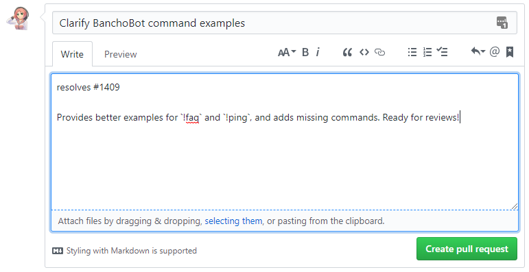

# osu! wiki Contribution Guide

Thanks for your interest in making the osu! wiki better! This quick-start guide is intended for newcomers that have never worked with GitHub and the osu! wiki contribution workflow before. If you already have experience using GitHub, feel free to skip this guide and follow the common feature-branch workflow for content updates in this repository.

If, during any part, you are confused and/or need further help, feel free to send a message to the [osu!dev Discord](https://discord.gg/ppy) (`#osu-wiki` channel).

## Getting started

### Signing up

1. [Sign up](https://github.com/join) for a GitHub account if you don't have one.

2. [Sign in](https://github.com/login).

3. Continue to [Forking](#forking).

### Forking

1. Go to the [`osu-wiki` repo](https://github.com/ppy/osu-wiki).

2. Click `Fork`.

3. Click `Fork` again to go to your fork.

4. Seeing something similar to the image below means you made a fork of `ppy/osu-wiki` repo and that you are on your fork.

5. Continue to [Syncing your fork](#syncing-your-fork).

### Syncing your fork

1. Go to your fork of the `osu-wiki` repo.

2. Above the files, there is some text to tell you if your branch is either "behind", "ahead", or "even" with `ppy:master`. If it says that the branch is either "behind" or "ahead and behind" with any amount of behind-commits, your branch is outdated.

")

")

")

")

3. This isn't much of a problem; that is, if you aren't going to edit a file that was already changed which may be unlikely the more commits you are behind.

4. To resolve this, see the [My branch is out of date! section in the Common Issues article](/wiki/owcg/Common_Issues/#my-branch-is-out-of-date!).

5. When you complete step 4, continue to [Editing online or locally](#editing-online-or-locally).

## Editing online or locally

At this point, you have two choices:

- [GitHub Web Interface](/wiki/owcg/GitHub_Web_Interface) - edit online; this is best for single article edits
- [GitHub Desktop](/wiki/owcg/GitHub_Desktop) - edit locally; this is best for single and/or multi article edits (this includes uploading, deleting, and moving images or files)

*Note: You are not limited to the two choices listed above for editing. To keep this guide short and simple, these articles will not discuss using other tools in-depth or at all. There are other third party applications that can do more or less than what the GitHub Web Interface and GitHub Desktop already does.*

**When you have completed either *GitHub Web Interface* or *GitHub Desktop*, you can continue to the next section.**

## Finishing

### Opening a pull request

1. Go to the [`ppy/osu-wiki` repo](https://github.com/ppy/osu-wiki).

2. If you were quick enough, you may see this yellow banner.

3. If you see it, click on the `Compare & pull request` button (skip to step 8). If not, click the `New pull request` button (continue to step 4).

4. On the next page, if you see these two buttons as pictured below, click the `compare across forks`.

5. Click on the `head fork` dropdown and select the one with your username (it should be the second one).

6. Click on the `compare` dropdown and select the one with the branch you had created (these are listed alphabetically).

7. Click `Create pull request`.

8. Enter the title in English. This should be a very brief explanation of what you changed.

  For article translations, include the two-letter language name of your translations in brackets before the title. Your title can just be the name of the article(s) that you are translating. For example, `[FR] BBCode` would indicate that you are updating the French translation of the [BBCode article](/wiki/BBCode).

9. Fill in the description box with a summary of your changes. You should mention any information relevant to your pull request, such as its completion status and anything you want reviewers to know. You can also make your pull request automatically close issues upon merge by writing "resolves #1" or "closes #1", etc. in the description (see [Closing issues using keywords](https://help.github.com/articles/closing-issues-using-keywords/) on GitHub Help).

10. Once you are ready, click `Create pull request`.

11. See [Reviews](#reviews) and [Merging](#merging) below.

### Reviews

Once you have created your pull request, other osu! wiki editors may review your changes to help catch some mistakes you may have missed. **You will need to keep up with these reviews,** otherwise your pull request may be marked for closure! If you want someone to review your pull request, you can ask other osu! wiki editors in the [osu!dev Discord](https://discord.gg/ppy) (`#osu-wiki` channel) or in the GitHub comments.

### Merging

For your changes to become appear live on the osu! wiki, your pull request has to be merged. Once your pull request has been reviewed and approved, you can either use the commenting section in GitHub to ask someone to merge it or do the same in the [osu!dev Discord](https://discord.gg/ppy) (`#osu-wiki` channel). Once it is merged, your changes will take up to five hours to appear live on the osu! wiki.
