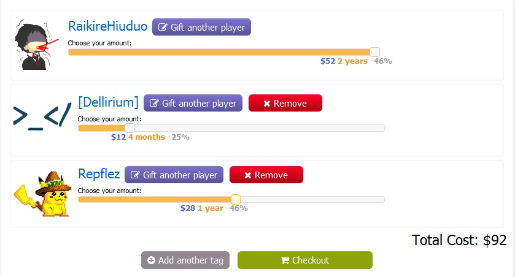
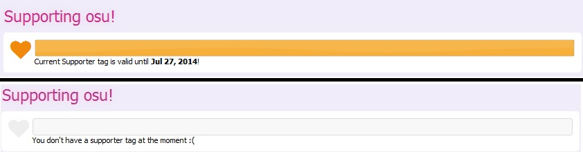
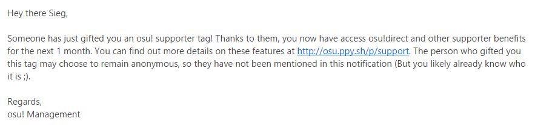

# osu!支持者

请参见该链接: <https://osu.ppy.sh/p/support>

简言之：赞助osu!可以从各方面帮助我们。

## osu!赞助者的优势

-   osu!direct (直接在游戏中下载谱面)
-   在使用osu!cuttingedge时可以进行多人游戏。
-   [聊天窗口](/wiki/Chat_Console): 其他玩家视角中，您的名字为亮黄色。 但在您自己的视角中则显示白色。
-   [谱面列表](https://osu.ppy.sh/p/beatmaplist): 按照已游玩和未游玩的铺面过滤搜索结果。
-   [皮肤](/wiki/Skinning): 可以使用一些额外的皮肤元素，例如 [主菜单](https://osu.ppy.sh/forum/t/96949)中的背景。
    -   具体包括： `menu-background.jpg` (主菜单)； `triangle.jpg` (三角形)； `welcome.wav` (欢迎音乐)； `seeya.wav` (退出声音)
-   [新功能需求](https://osu.ppy.sh/forum/4): 新功能需求的的额外投票 （每月2票，未赞助时每月1票）
-   [歌曲选择](/wiki/Interface): 能在游戏中查看您所在国家/朋友/mod特定排名。
-   个人主页: <https://osu.ppy.sh/u/>
    -   你可以在你的个人主页上添加个人介绍。
        -   即使你的osu！支持者到期了，你的个人介绍也不会被删除。
    -   你可以[更改用户名](https://osu.ppy.sh/p/profile-username/).
        -   你可以免费更改一次用户名，无论你的osu！支持者是否到期。
    -   增加了谱面提交限制（最多10个审查中的铺面）。
-   [Performance Ranking](https://osu.ppy.sh/p/pp): 允许“在朋友中筛选”。
-   *还有更多的功能即将到来！*

## Business part

### 花费

[使用此货币转换器](https://www.oanda.com/currency/converter/) 或自行 [百度](https://www.baidu.com) 来查询您国家的汇率。 花费以“美元（$）”为货币单位。

| 月 | 花费 {$} (总体实际值) |
|--------|--------------------------------------|
| 1      | 4                                    |
| 2      | 8                                    |
| 4      | 12 (-25%)                            |
| 6      | 16 (-33%)                            |
| 8      | 20 (-38%)                            |
| 9      | 22 (-39%)                            |
| 10     | 24 (-40%)                            |
| 12     | 26 (最多-46%)                        |
| 24     | 52 (最多-46%)                        |

-   费用将支付给个人帐户。没有团体馈赠的促销活动。

### 确认

默认情况下，将显示您的帐户。如果你不想要osu！支持者，点击“赠与另一个玩家”并输入该玩家的账户名称。如果您想赠送给多个帐户，请点击“结帐”按钮旁边的“添加另一个标志”按钮。确认帐户后，拖动帐户下方的白色按钮，可以确定帐户需要多长时间，以及总共需要支付的钱数。您可以为不同的账户支付不同的时间以及不同的费用。确认好期限和账户后，点击“结帐”。

付款
-------

确认期限和账户后，点击“结帐”。在这里，你可以选择不同的支付方式。建议使用 [PayPal](https://www.paypal.com) 或信用卡。或其他支付方式（例如[Cherry Credits](https://www.cherrycredits.com/)的短信支付），但他们可能收取您手续费。如果您支付的费用低于“总费用”（包括使用非PayPal时的额外费用），则不会收到您的标志。

### 持续时间

 交易完成后，您的个人资料的近期活动将会显示“{某玩家}已成为osu！支持者 - 感谢您的慷慨解囊！” （第一次成为支持者时） 或 “{某玩家} 再次选择捐赠osu! - 感谢您的慷慨解囊！” （您以前曾是支持者时） 。如果您为自己购买了osu!支持者，则可以在您的个人资料图片下方看到osu！支持者徽章。 想知道osu!支持者 *何时* 到期，请转到 [osu!支持者 页面](https://osu.ppy.sh/p/support)。

 哦，你还会收到osu！的“感谢”信！就像上面那样。
